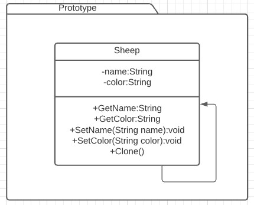

# Prototype
Es un patrón creacional. [Link descripción](https://sourcemaking.com/design_patterns/prototype)

## Diagrama de clases

## SOLID

* Single responsibility

La responsabilidad del objeto prototype no está atada a la implementación de su método de clonado.

* Open/Closed principle

Un objeto prototype puede ser extendido para ampliar o cambiar su funcionalidad sin problema.

* Liskov substitution

Este principio tampoco entra en conflicto con la implementación de un prototype, cualquier hijo del objeto prototype debería comportarse como su padre dadas las circunstancia.

* Interface segregation

Un buen diseño de interfaces no coliciona con el desarrollo de un prototype.

* Dependency inversion

Las dependencias del objeto prototype pueden estar referenciadas mediante interfaces de alto nivel si se modela con cuidado. Quizas utilizando factories o builders.